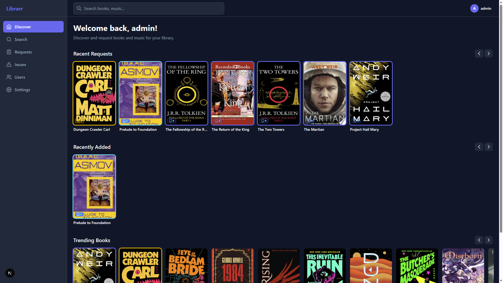
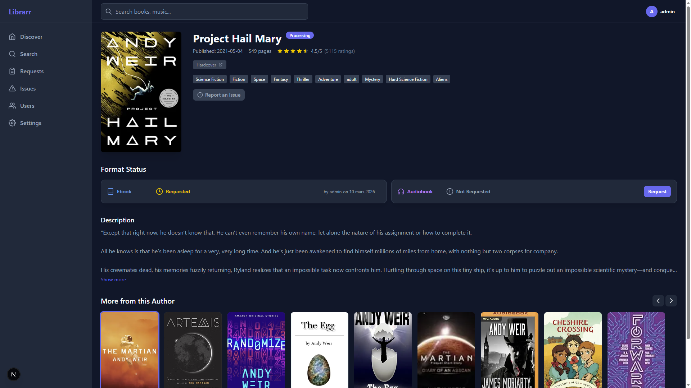
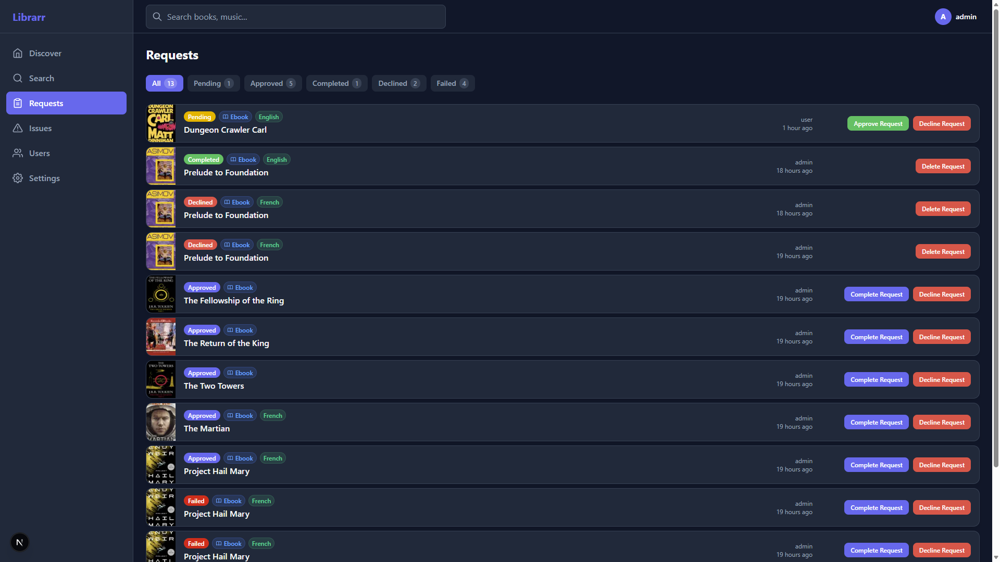
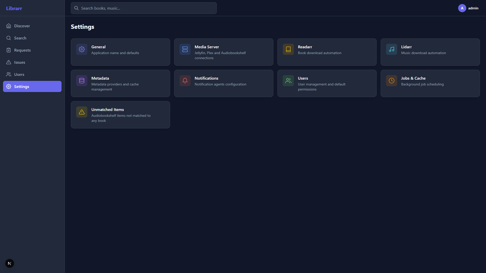

<p align="center">
  
</p>

<p align="center">
  A media request management system for books and music.<br/>
  Discover, request, and track ebooks, audiobooks, and music albums,<br/>
  with automated fulfillment through Readarr and Lidarr.
</p>

<p align="center">
  <a href="https://github.com/Navino16/Librarr/actions/workflows/ci.yml"></a>
  <a href="https://github.com/Navino16/Librarr/actions/workflows/build.yml"></a>
</p>

<p align="center">
  <a href="https://github.com/Navino16/Librarr/pkgs/container/librarr"></a>
  <a href="https://github.com/Navino16/Librarr"></a>
  <a href="LICENSE"></a>
</p>

<p align="center">
  <a href="docs/01-installation.md">Installation</a> &bull;
  <a href="docs/02-getting-started.md">Getting Started</a> &bull;
  <a href="docs/03-development.md">Development</a>
</p>

---

Built with Express 5, Next.js 16, React 19, and SQLite.

## Screenshots

| Discover | Book Detail |
|----------|-------------|
|  |  |

| Requests | Settings |
|----------|----------|
|  |  |

## Features

### Request & Discovery

- **Unified request system** for ebooks, audiobooks, and music albums
- **Discovery feeds** — trending books, trending music, recently requested, recently added
- **Multi-source search** with automatic ISBN detection
- **Request workflow** — pending, approved, declined (with reason), completed, failed
- **Auto-approve** — configurable per user/role
- **Request quotas** — separate limits for ebook, audiobook, and music requests per 7-day window, configurable per role with per-user overrides
- **Download progress tracking** — live progress from Readarr/Lidarr queues
- **Language preferences** — request books in a preferred language

### Media Details

- Book metadata with editions, series, authors, genres, ratings
- Music metadata with tracklists, artists, album types
- Author and artist profile pages with full catalogs
- Format availability indicators (ebook, audiobook, or both)

### Issue Tracking

- Report issues on media items (metadata, quality, format, missing content)
- Threaded comments on issues
- Resolve/reopen workflow with notifications

### User Management

- **Authentication** — local accounts, Plex (PIN flow), OIDC (multiple providers, PKCE)
- **Role-based permissions** — Admin, Manager, User, or custom roles
- **26 granular permissions** — request creation, auto-approve, request management, quotas, issue management, settings access
- Rate-limited login (10 attempts per 15 minutes)

### Integrations

| Service            | Role                                     |
|--------------------|------------------------------------------|
| **Readarr**        | Download manager for books               |
| **Lidarr**         | Download manager for music               |
| **Audiobookshelf** | Library source for ebooks & audiobooks   |
| **Jellyfin**       | Library source                           |
| **Plex**           | Library source & authentication provider |
| **Hardcover**      | Primary book metadata provider           |
| **Google Books**   | Fallback metadata (ISBN lookup)          |
| **OpenLibrary**    | Fallback metadata (editions, open data)  |
| **MusicBrainz**    | Music metadata                           |

Multiple servers supported per service. Provider priority is configurable.

### Notifications

- **Global agents** — Discord (webhook), generic Webhook
- **Per-user agents** — Email (SMTP)
- Notification types: new request, approved, declined, failed, available, auto-approved, issue events
- Per-user notification preferences with permission-based filtering

### Admin Settings

- Enable/disable media types (ebooks, audiobooks, music)
- Metadata provider priority and caching
- Background job management with manual triggers
- Unmatched media item tracking

### UI

- Dark theme, responsive design (Tailwind CSS 4)
- Internationalization — English, French
- Setup wizard for first-time configuration

## Quick Start

```bash
docker compose up -d
```

Then open [http://localhost:5055](http://localhost:5055) and follow the setup wizard.

See [docs/installation.md](docs/01-installation.md) for detailed installation instructions.

## Development

See [docs/development.md](docs/03-development.md) for development setup instructions.

## License

[GNU General Public License v3.0](LICENSE)
